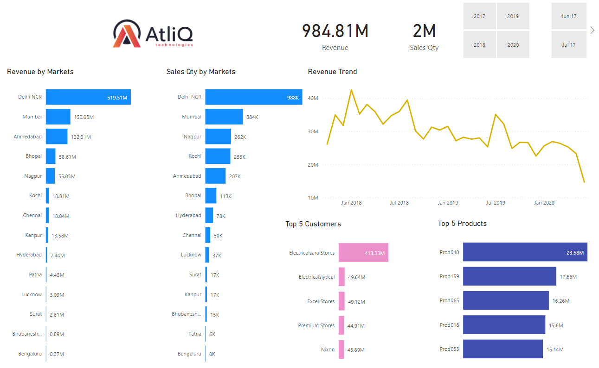

# AtliQ Hardware Sales DashBoard

AtliQ hardware sell hardware components all over the india, they sell millions of products every year. Using Power Bi we created them an Intreactive dashboard which will help them
to track real-time data of their sales, from best performing demographic areas to top buying customers this Dashboard consist all.

## This Dashboard Consist

Revenue Trend throught years.

Top 5 Buying customers.

Top 5 selling Products.

Revenue by Markets.

Quantity sold by Markets.

## Extra Functionality

Real-Time Updates to Dashboard by providing On Premises Gateway Connectivity

Scheduled data Refresh over specific interval of time.

